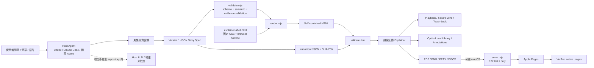
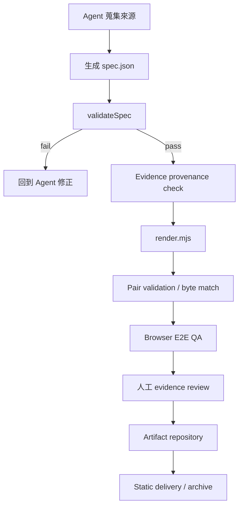

# Fireworks Open ELI5 深度研究與程式碼審查報告

## 執行摘要

本報告的研究快照為 **2026-08-25（Asia/Taipei）**，主要針對 `yizhiyanhua-ai/fireworks-open-eli5` 的 `main` 分支、最新提交 `e90d5f9dae1bb823573388654e381a9844169e1b` 進行原始碼層級檢視。該專案在 2026-08-24 才公開，目前提交歷史只有兩筆：初始開源提交 `c001001...`，以及隨後修正 headless Agent 安裝驗證的 `e90d5f9...`；GitHub 目前顯示 **Issues 0、Pull Requests 0**，且 **沒有 GitHub Release**。不過 `CHANGELOG.md` 已將 `1.0.0 - 2026-08-24` 標為「Initial open-source release candidate」。最新 `main` 對應的 GitHub Actions CI run 已完成且結論為 `success`。因此，較精確的成熟度描述不是「穩定 1.0 正式版」，而是**已有完整工程骨架、但公開社群驗證期幾乎尚未開始的 1.0.0 release candidate**。 citeturn11view0turn11view2turn11view3turn12view0 fileciteturn27file0L2-L2

最重要的判讀是：**這不是一個要訓練或本地執行大型語言模型的 ML repository。** 它是一個可安裝於 Codex、Claude Code 或相容 Agent Skills host 的「Agent Skill + deterministic compiler」。Host agent 負責理解問題、讀取證據並產生 version 1 JSON story spec；之後 `validate.mjs` 驗證語意與安全邊界，`render.mjs` 將 spec 編譯成單一、自包含、離線可用的 HTML，再由 validator 對 CSP、spec SHA-256、runtime/style hash 與必要時的 byte-for-byte deterministic render 做驗證。Repo **沒有模型權重、沒有訓練程式、沒有 tokenizer、沒有 PyTorch/TensorFlow、沒有訓練資料集，也沒有 npm runtime dependencies**。 citeturn9search1turn13view0turn13view1 fileciteturn16file0L2-L2

專案最有價值的設計不是畫圖本身，而是它把「簡化說明」納入一個相當嚴格的**證據與可重現性契約**：`verified / inferred / analogy` 三分法、四種 story grammar（concept/module/tradeoff/incident）、跨節點 reference integrity、failure lens、trace playback、teach-back，以及 deterministic HTML + SHA-256 binding。產生的 artifact 可以離線閱讀，並能在瀏覽器本機輸出 PDF、1600×900 PNG、PPTX、DOCX；macOS 上另外可透過只綁定 `127.0.0.1` 的 helper 讓 Apple Pages 真正另存 `.pages`，而非單純改副檔名。 citeturn9search1turn13view2 fileciteturn20file0L2-L2 fileciteturn21file0L2-L2

工程品質整體明顯高於一般只有 `SKILL.md` 的 prompt repository：它有 adversarial tests、四種 mode fixtures、HTML tampering tests、symlink/overwrite tests、DOCX/PPTX 結構測試、loopback helper 的 origin/token/body-size 驗證，以及 Node 18/20/22/24 CI matrix；GitHub Actions 本身也以完整 SHA pin `checkout` 與 `setup-node`，並關閉 checkout credentials persistence。 fileciteturn15file0L2-L2 fileciteturn22file0L2-L2 fileciteturn28file0L2-L2

但有三個高價值缺口。第一，**「verified」目前是結構上的 verified，不是語意上的 verified**：validator 能證明來源 locator 存在、URL 是 HTTP(S)、reference 能解析，卻不會證明某項 claim 真的被該來源支持，也不會把來源檔案的 commit SHA、line range 或 content hash 綁進 spec；來源日後變更時，artifact 的 spec hash 仍可能完全不變。第二，專案文件要求 desktop/390px/browser/export QA，但現有 CI 只有 Node 級測試，沒有 Playwright 類的真正 browser E2E。第三，安裝 README 使用可變的 `skills@latest`，而 CI canary 卻刻意固定 `skills@1.5.23`；前者形成了不必要的供應鏈漂移。 fileciteturn8file0L2-L2 fileciteturn15file0L2-L2 fileciteturn23file0L2-L2 citeturn9search1

**綜合評價：**若目的是「把技術系統做成可交付、可稽核、離線的互動解說 artifact」，Fireworks Open ELI5 的架構比一般 ELI5 skill 成熟很多，尤其在 reproducibility、安全邊界與證據視覺化方面很有特色；但若要把它投入企業正式知識治理或法規敏感場景，我會先補上**來源內容不可變識別、browser E2E、正式 release/provenance、zh-TW regression coverage**，再稱為 production-ready。

> **研究方法說明：**本次透過 GitHub repository/API 原始檔介面逐檔取回 README、核心程式、配置、tests、evals、LICENSE/NOTICE、Issues、PR、Releases 與 commit/CI metadata 進行審查。本研究環境無法直接 DNS 解析 `github.com` 來重新 `git clone` 並本地執行整套測試，因此下文不會把上游 CI 結果冒充成本次本機重跑結果；能確認的是，GitHub 上 `e90d5f9...` 對應的 CI run 結論為成功。 fileciteturn27file0L2-L2

## 專案概覽與檔案／模組表格

Fireworks Open ELI5 將自身定義成「open, portable Agent Skill」，目的是把複雜的 concept、repository module、engineering tradeoff 或 incident 轉換為**有證據邊界、可播放、可探索、可離線交付的互動視覺解說**。與一般「LLM 直接吐一頁 HTML」的做法不同，它先要求 agent 生成結構化 JSON，再由固定 renderer 編譯，因此把非決定性的 LLM 工作與決定性的 artifact generation 明確分離。 citeturn9search1turn13view0

其核心資料模型限制頗嚴格：version 必須為 `1`；language 為 `en`、`zh-CN`、`zh-TW`；mode 為 `concept`、`module`、`tradeoff` 或 `incident`；每份 artifact 有 3–7 scenes，每 scene 2–6 nodes、1–12 edges，另有 1–24 個 trace steps、1–16 glossary entries、1–3 teach-back questions、1–40 evidence entries。不同 mode 另有各自 semantic contract，例如 module mode 必須把 source evidence 指向 verified local path；incident recovery node 必須出現在 first break 之後。 fileciteturn20file0L2-L2 fileciteturn8file0L2-L2 fileciteturn9file0L2-L2

整體架構可整理如下：



這個圖最值得注意的是左上角的 **Host Agent 是 architecture boundary，而不是 repository 裡的 model module**。`agents/openai.yaml` 只是宣告顯示名稱、預設 prompt 以及允許 implicit invocation；它不包含推理 API、model ID 或權重。 fileciteturn17file0L2-L2

主要檔案與模組如下。

| 檔案／模組 | 主要功能 | 關鍵函式／介面 | 相依性與版本 |
|---|---|---|---|
| `SKILL.md` | Agent 的完整工作流程、證據規則、QA 與 delivery boundary；要求先 evidence、再 spec、再 validate/render | 10-step workflow；四種 grammar；quality gate | Agent Skills-compatible host；Node.js **18+**；Host model **未指定**。 citeturn13view0turn13view1turn13view2 |
| `agents/openai.yaml` | OpenAI/Codex 類 host 的 Skill UI metadata | `display_name`、`short_description`、`default_prompt`、`allow_implicit_invocation` | 無 runtime package；格式版本**未指定**。 fileciteturn17file0L2-L2 |
| `references/spec-contract.md` | Version 1 JSON semantic contract | concept/module/tradeoff/incident contracts；evidence locator rules | 自訂 schema；**沒有獨立 JSON Schema package/version**。 fileciteturn20file0L2-L2 |
| `scripts/validate.mjs` | 驗證 spec 與生成 HTML；產生 canonical hash；鎖定 CSP/runtime/style | `validateSpec()`、`validateHtml()`、`canonicalJson()`、`hashSpec()`、`expectedCsp()` | Node built-ins：`crypto`、`fs`、`url`；Node **>=18**。 fileciteturn8file0L2-L2 fileciteturn9file0L2-L2 |
| `scripts/render.mjs` | deterministic compiler：JSON → HTML | `render()`、`renderScene()`、`renderModePanel()`、`buildContent()` | Node `fs/path/url` + 本專案 validator；Node **>=18**。 fileciteturn10file0L2-L2 fileciteturn12file0L2-L2 |
| `assets/explainer-shell.html` | 固定的 CSS、DOM/browser runtime、SVG flow、playback、workspace、Canvas/OOXML export | browser-side playback、layout、PNG/PPTX/DOCX builders、localStorage workspace | 現代瀏覽器；具體 browser/version **未指定**。第三方 JS **無**。 citeturn9search1 fileciteturn21file0L2-L2 |
| `scripts/serve.mjs` | 可選的 loopback static server 與 native Pages conversion helper | `parseArguments()`、`sameOriginRequest()`、`collectBody()`、`validateScenePng()` 等 | Node `http/crypto/zlib/child_process/fs`；native `.pages` 額外需要 **macOS + Apple Pages，版本未指定**。 fileciteturn24file0L2-L2 |
| `assets/example-spec.json` | canonical 中文 DNS concept 範例 | 3 scenes、7-step trace、RFC 1034 verified evidence、analogy/inferred evidence | JSON v1；非訓練資料。 fileciteturn25file0L2-L2 |
| `evals/evals.json` / `evals/trigger-evals.json` | Agent Skill 任務品質、trigger 行為評估題 | DNS、repo request path、SSE/WebSocket、cache incident、PKCE、language behavior | 不屬於 training dataset；評測 runner/model **未指定**。 citeturn13view3 |
| `tests/fireworks-open-eli5.test.mjs` | deterministic、安全、四 grammar、CLI、loopback、PPTX/DOCX 等單元/整合測試 | Node `test()` cases；直接 import `render` / validators | Node built-in `node:test`；無 Jest/Vitest/Playwright。 fileciteturn22file0L2-L2 fileciteturn28file0L2-L2 |
| `scripts/quick-validate.mjs` | canonical example smoke test；雙 render 比 byte deterministic | `render()` ×2、`validateSpec()`、`validateHtml()` | 純 Node built-ins。 fileciteturn26file0L2-L2 |
| `scripts/agent-install-canary.mjs` | 在隔離 workspace 驗證 Codex + Claude Code Skill installation | `npm pack` → `npx skills` → render/validate canary | 預設鎖 **`skills@1.5.23`**；此 canary 要 Node **22.20+**。 fileciteturn23file0L2-L2 |
| `.github/workflows/ci.yml` | syntax/test/example/distribution/agent-install CI | Node 18/20/22/24 matrix | `actions/checkout` v5 與 `actions/setup-node` v5 皆鎖完整 SHA。 fileciteturn15file0L2-L2 |
| `package.json` | metadata、Node engine、scripts、release file allowlist | `test`、`check`、`check:release`、`check:install`、`check:agent-install` | package version **1.0.0**、Node **>=18**；**無 dependencies/devDependencies**；`private:true`。 fileciteturn16file0L2-L2 |
| `LICENSE` / `NOTICE` | Apache-2.0 授權及第三方/靈感 attribution | Apache-2.0；Anthropic community ELI5 inspiration；owl workflow attribution | Apache-2.0；`ip-as-logo` workflow 為 MIT。 citeturn14view0turn14view1 fileciteturn14file0L2-L2 |

專案的 canonical DNS 範例很能體現設計哲學。它明確將「DNS 像通訊錄」列為 analogy，把 DNS cache/recursive resolver/root-authoritative chain 列入 technical truth，再把「DNS 回答不等於建立連線」放進 caveat；RFC 1034 為 `verified`，後續連線界線則標成 `inferred`。這比單純生成漂亮流程圖多了一層 epistemic structure。 fileciteturn25file0L2-L2

## 安裝與執行流程

**最簡單的 standalone 使用並不需要 `npm install`。** `package.json` 沒有 `dependencies` 或 `devDependencies`，runtime requirement 是 Node.js 18+；README 也明確說 rendering 不需要 Python、browser 或網路。瀏覽器是在「閱讀/互動/匯出」階段才需要。 citeturn9search1 fileciteturn16file0L2-L2

快速上手可按以下順序進行：

1. 取得 repository，確認 Node.js 版本至少 18。
2. 先驗證 canonical example。
3. 將 JSON spec render 成一個新的 HTML。
4. 將 spec 與 HTML 配對再次驗證。
5. 用 browser 開啟 HTML；需要 native Pages 時才啟動 loopback helper。
6. 開發者再跑 `npm run check`；若要驗證 Agent Skills CLI 安裝，需 Node 22.20+ 並執行 `npm run check:agent-install`。 citeturn9search1turn13view1

```bash
git clone https://github.com/yizhiyanhua-ai/fireworks-open-eli5.git
cd fireworks-open-eli5

node --version

# 驗證 canonical spec
node scripts/validate.mjs assets/example-spec.json

# 產生新的 self-contained HTML
node scripts/render.mjs assets/example-spec.json example.html

# 驗證 spec 與 artifact 的 hash / deterministic binding
node scripts/validate.mjs assets/example-spec.json example.html

# 完整 Node 級品質門檻
npm run check
```

Renderer 預設採 **create-only** 行為：輸出檔已存在就失敗，而不是默默覆寫；只有明確加上 `--force` 才會替換。`--force` 路徑先以 `lstat()` 拒絕 symbolic link 與非一般檔案，再寫 temporary file 後 rename；相關行為也有 regression test。 fileciteturn12file0L2-L2 fileciteturn28file0L2-L2

```bash
node scripts/render.mjs spec.json output.html --force
```

若安裝成 Agent Skill，README 的公開指令是：

```bash
# Codex
npx skills@latest add yizhiyanhua-ai/fireworks-open-eli5 -g -a codex -y

# Claude Code
npx skills@latest add yizhiyanhua-ai/fireworks-open-eli5 -g -a claude-code -y

# 同時安裝
npx skills@latest add yizhiyanhua-ai/fireworks-open-eli5 \
  -g -a codex -a claude-code -y
```

README 目前用的是可變的 `@latest`；相反地，repository 自己的 release canary 把版本固定為 `skills@1.5.23`，而該 canary 明確檢查 Node 22.20+。對企業或 reproducible installation，我會採用經內部驗證過的固定版本，而不是直接允許 production environment 跟著 `latest` 漂移。 citeturn9search1 fileciteturn23file0L2-L2

在 native Pages 路徑，推薦從受信任目錄啟動：

```bash
node scripts/serve.mjs \
  --root /absolute/path/to/explainers \
  --port 8772
```

`serve.mjs` 強制 host 必須是 `127.0.0.1`，預設 port 8772；它限制 DOCX request 到 25 MiB、expanded contents 40 MiB、32 entries，檢查 exact same-origin、rotating token、PNG CRC/1600×900 dimensions，並以 timeout 限制 request 與 Apple Pages automation。這是一個相當明確的 local-only security model，不適合作為 LAN 或 Internet server。 fileciteturn24file0L2-L2 fileciteturn19file0L2-L2

訓練、推理、模型與資料需求則應這樣解讀：

| 項目 | 結論 | 說明 |
|---|---|---|
| 模型訓練流程 | **不適用／未提供** | Repo 沒有 optimizer、loss、checkpoint、training loop 或 ML framework。 fileciteturn16file0L2-L2 |
| 模型推理程式 | **Repo 內不提供** | 自然語言 → JSON spec 是由 Host Agent 執行；`SKILL.md` 是 instructions，而非 model runtime。 citeturn13view0turn13view1 |
| 模型名稱 | **未指定** | 可由 Codex、Claude Code 或另一 Agent Skills-compatible host 使用；不綁特定 model ID。 citeturn13view0 |
| 模型權重來源 | **未指定／不隨 repo 發佈** | 沒有 `.safetensors`、GGUF、PyTorch checkpoint 等權重。 |
| 權重格式 | **不適用** | 同上。 |
| GPU | **未要求** | Renderer/validator 是 Node.js CPU 程式；Host model 的運算資源屬 host 外部邊界。 citeturn9search1 |
| CPU/RAM | **最低規格未指定** | 只指定 Node 18+；沒有 RAM/CPU benchmark。 |
| 訓練資料集 | **沒有** | `evals/` 是任務評估 prompt，不是 training corpus。 citeturn13view3 |
| 輸入資料需求 | 問題、受眾、語言、證據 | Repository 模式要求讀實際 source paths；external claim 建議 authoritative sources。 citeturn13view1 |
| 預處理 | 人/agent 進行 evidence extraction 與分類 | 將內容整理為 verified / inferred / analogy，再結構化成 v1 spec。 fileciteturn20file0L2-L2 |
| Browser | modern browser，**版本未指定** | 用於 interactive UI 與 PDF/PNG/PPTX/DOCX export。 citeturn9search1 |
| Native Pages | macOS + Apple Pages，**版本未指定** | Linux/Windows 無 native `.pages` conversion。 fileciteturn21file0L2-L2 |

換句話說，這裡可以把「推理流程」理解成：

```text
LLM/Agent 推理（非 deterministic）
    ↓
story spec JSON
    ↓
validate / render / validate（deterministic）
    ↓
offline HTML artifact
```

這種分離其實是專案很重要的工程優勢：**LLM 可以變、model 可以換，但只要輸出的 v1 spec 一樣，rendered bytes 理論上也一樣。** `quick-validate.mjs` 明確 render 同一份 spec 兩次並比較 HTML bytes；正式 pair validation 還會重新 render，若與 artifact 不完全相同就判失敗。 fileciteturn26file0L2-L2 fileciteturn9file0L2-L2

## 程式碼品質分析

若以「剛開源一天的 Agent Skill」為基準，這個 repository 的 engineering discipline 是偏強的；若以「企業 production artifact compiler」為基準，則還有幾個成熟度缺口。以下評分是本次程式碼審查的分析性評價，而非 upstream 官方指標。

| 面向 | 評價 | 分析 |
|---|---:|---|
| 可讀性 | **4/5** | 命名清楚、CLI JSON output 一致、contract 文件完整；但 renderer/browser shell 已集中大量責任。 |
| 文件 | **5/5** | README、中文 README、SKILL、SECURITY、CONTRIBUTING、spec/evidence/visual/export/reporting contracts 齊全。 citeturn9search1turn13view2 |
| 測試 | **4/5** | 有 deterministic、grammar、XSS-like hostile text、symlink、PPTX/DOCX、loopback security 等實質測試；缺真正 browser E2E、coverage 與 fuzzing。 fileciteturn22file0L2-L2 fileciteturn28file0L2-L2 |
| 錯誤處理 | **4/5** | CLI 回傳機器可讀 JSON 並設 non-zero exit；create-only/force boundary 清楚。 fileciteturn9file0L2-L2 fileciteturn12file0L2-L2 |
| Security by design | **4.5/5** | CSP hash、exact trusted runtime/style hash、無 remote runtime、loopback-only helper、bounded parser、adversarial tests 都很扎實。 fileciteturn9file0L2-L2 fileciteturn24file0L2-L2 |
| 效能 | **4/5** | Spec 本身有嚴格上限，所以演算法熱點目前規模很小；最大成本更可能是瀏覽器 canvas/OOXML export 與 Pages automation。 |
| 可擴充性 | **3.5/5** | mode contracts 清晰，但手寫 validator、renderer 與巨大 shell 會提高 V2 schema/功能擴展成本。 |
| 專案成熟度 | **2/5** | 開源歷史只有兩 commits、零 public issue/PR、無 GitHub Release，尚缺外部使用者的實戰驗證。 citeturn11view0turn11view2turn11view3 |

**安全設計是目前最突出的優點。** `validateHtml()` 不只是檢查 HTML 能否 parse：它要求 CSP meta 必須等於由 trusted template runtime/style 算出的預期值；runtime script 與 style block 都必須只有一個且 hash 完全吻合；禁止 external script/style、remote media、inline event handlers、`javascript:` URL、iframe/object/form，並檢查 XHR、WebSocket、sendBeacon、dynamic import、eval、Function constructor、HTML-string DOM insertion、cookies 等 runtime patterns。若同時傳入 source spec，validator 還會檢查 embedded data hash，最後重新 deterministic render 做 byte equality。 fileciteturn9file0L2-L2

測試也不是只有「happy path」。現有 tests 包含惡意 `</script><script>bad()</script>` 字串保持 inert、`javascript:` evidence URL 被拒、duplicate/missing refs 被拒、tampered embedded spec 被發現、額外 external runtime 被拒、symbolic-link overwrite 被拒；loopback helper 測試還包含 oversized body 413、cross-origin 403、wrong token 403、malformed DOCX、fake PNG 與 directory symlink escape。 fileciteturn28file0L2-L2

CI 設計也合理。quality job 在 Node 18、20、22、24 跑 syntax、tests、quick validate；distribution job 跑 release package 與 install canary；agent-install job 在 Node 24 驗證 Codex/Claude Code installation。workflow 只有 `contents: read` 權限，而且 `actions/checkout` 使用完整 commit SHA 並設定 `persist-credentials:false`。這比直接用浮動 action tag 的供應鏈風險低。 fileciteturn15file0L2-L2

但目前最重要的品質缺口是 **evidence validation 尚未等同 evidence verification**。例如 `validateSpec()` 對 `verified` evidence 所做的核心條件，是要求有 HTTP(S) URL 或 local path；它並不打開該 locator 再判定「此來源是否真正支持該 claim」。更重要的是，spec 沒有要求 `commitSha`、`lineStart/lineEnd`、`contentSha256`。因此，一份 module explainer 可以今天引用 `src/foo.js` 為 verified，日後該檔案完全改寫，舊 artifact 仍保留一樣的 spec hash；**hash 保證的是 spec 完整性，不是 underlying evidence immutability**。這是我認為企業使用前最值得補的 P0/P1 級能力。 fileciteturn8file0L2-L2 fileciteturn20file0L2-L2

第二個缺口是 browser QA 與 CI 之間有落差。`SKILL.md` 明文要求 desktop 與 390px 檢查 focus、overflow、tablists、playback、edge/evidence synchronization、export 等；`library-and-export.md` 也列出一整套 browser QA contract。可是 CI workflow 沒有安裝 Chromium/Firefox/WebKit，也沒有 Playwright/Selenium；現有測試很多是對 generated HTML/runtime source 做 regex、抽取 function 或 Node 端結構驗證。這對安全與 deterministic 很有效，卻不能捕捉實際 CSS clipping、focus trap 失靈、SVG geometry 在特定 browser broken、download behavior 或 native accessibility tree regressions。 citeturn13view1turn13view2 fileciteturn21file0L2-L2 fileciteturn15file0L2-L2

第三個是 maintainability。`render.mjs` 同時承擔 localization、mode view rendering、scene rendering、workspace HTML 組裝與 file-output semantics；`explainer-shell.html` 又同時放 style、diagram geometry、state machine、storage、PNG/OOXML builders、Pages client runtime。對一個零依賴、單檔輸出專案而言這有合理性，但「source modularity」和「distribution artifact single-file」其實不必是同一件事。建議開發時拆成 renderer/layout/export/storage/playback/security modules，CI 再產生並驗證一份 checked-in deterministic shell bundle，而不是讓人手直接維護單一大型 shell。 fileciteturn10file0L2-L2 fileciteturn11file0L2-L2

第四，HTML validator 很大程度使用 regex；在目前「唯一允許的 executable runtime/style 必須 exact hash match」的設計下，這比一般 regex sanitizer 安全得多，因此不應簡單批評為「regex parsing insecure」。真正的風險是**未來模板語法複雜化時，validator 與 renderer 的 assumptions 可能逐步漂移**。建議新增 corpus fuzzing/property testing，專門攻擊 script/style/meta/attribute 邊界，而不是急著引入大型 HTML parser runtime dependency。 fileciteturn9file0L2-L2

第五，`--force` 有一個低優先度的檔案系統 TOCTOU 面向：程式先 `lstat(outputPath)` 判斷不是 symlink，之後才寫 temp 並 `rename()`；若是在惡意、共享且可同時變更目的 path 的本機 filesystem 中，檢查與 rename 中間存在理論 race window。這不是一般單使用者 CLI 的重大漏洞，而且測試已覆蓋靜態 symlink 情境；若要把工具放入 hostile multi-user automation，可在 rename 前再次檢查 inode/path，並研究平台支援的 no-follow/open-at 類更強 primitive。此項是**本報告根據程式碼做的推論，而非 upstream 已確認漏洞**。 fileciteturn12file0L2-L2 fileciteturn28file0L2-L2

最後是 locale coverage。runtime/spec 明確支援 `zh-TW`，但 repository 全域搜尋 `zh-TW` 只落在 contract、validator、renderer，沒有 surfaced 出 dedicated `zh-TW` test fixture；canonical DNS example 為 `zh-CN`，evals 中也以 zh-CN/English 為主。對宣稱三語 UI 的專案而言，增加繁體中文 regression fixture 是成本很低、價值很高的改善。 fileciteturn29file0L2-L5 fileciteturn29file1L6-L10 fileciteturn29file2L11-L15 fileciteturn25file0L2-L2

## 授權與風險

專案採 **Apache License 2.0**。該授權提供永久、全球、非專屬、免權利金的 copyright license，允許重製、修改、公開展示、再授權及散布，也包含相應的 patent grant。因此，從 repository 本身的程式碼授權看，**商業使用與研究使用都是允許的**；`package.json` 中的 `"private": true` 只是防止 npm 意外 publication 的 package metadata，並不是「禁止商用」。 citeturn14view0 fileciteturn16file0L2-L2

再散布時需留意 Apache-2.0 條件：接收者需取得 License；修改過的檔案要有明顯變更聲明；相關 copyright/patent/trademark/attribution notices 要保留；因本專案有 `NOTICE`，適用的 NOTICE attribution 在 derivative distribution 中也要以規定方式保留。Apache-2.0 並不授與 licensor 商標使用權，且軟體以 AS-IS 方式提供、無一般性的 warranty。 citeturn14view0turn14view1turn14view2

`NOTICE` 特別說明兩個來源關係：Fireworks Open ELI5 是受到 Anthropic community `eli5` skill 啟發的 independent implementation，並非 Anthropic affiliated/sponsored/endorsed，也不需要該 skill 的 source code 作 runtime；owl identity 則使用 `ip-as-logo` art-direction workflow，NOTICE 將該 workflow 標示為 MIT。這些 attribution 在企業 fork/repackaging 時不應隨意刪除。 fileciteturn14file0L2-L2

第三方與供應鏈風險可整理如下：

| 項目 | 風險 | 判斷 |
|---|---|---|
| npm runtime dependencies | **低** | package manifest 沒有 dependencies/devDependencies，核心 renderer/validator 全為 Node built-ins。 fileciteturn16file0L2-L2 |
| `skills@latest` 安裝 | **中** | README 的 `@latest` 是 mutable supply-chain input；同 repo CI 其實固定為 `1.5.23`。建議 production pin version。 citeturn9search1 fileciteturn23file0L2-L2 |
| GitHub Actions | **低～中** | 兩個第三方 GitHub Actions 都 pin 到完整 SHA，且 checkout credentials 不持久化。 fileciteturn15file0L2-L2 |
| Apple Pages / `osascript` | **中** | proprietary optional runtime，版本未指定；macOS/Pages 更新可能使 automation 行為改變。 fileciteturn21file0L2-L2 |
| Host Agent / LLM | **中～高，依使用環境** | Repo 不控制 host model、權限與資料政策；Skill 會繼承 host agent 可使用的本機檔案/工具能力。 README 也提醒應先 review Skills。 citeturn9search1 |
| Browser localStorage | **中，若存敏感內容** | Opt-in 且 bounded，但資料未加密，同 origin script 可讀；SECURITY 明確說不可拿來存 secrets。 fileciteturn19file0L2-L2 fileciteturn21file0L2-L2 |
| Evidence URLs | **低～中** | runtime 不會自動 fetch，但讀者仍可點擊任意合法 HTTP(S) locator；host/domain 並未 allowlist。 fileciteturn8file0L2-L2 |
| Local source paths | **中，分享 artifact 時** | path 會成為 evidence 可見內容；可能洩漏私有 repo layout、username、internal directory name。這是由資料模型推導的 disclosure risk。 fileciteturn20file0L2-L2 |

資料治理與倫理風險也不能被「verified」標籤掩蓋。Agent 本身可能把不充分證據錯標為 verified、把複雜因果關係過度簡化，或在 incident 分析中把 correlation 誤寫成 root cause。現有 validator 能限制 `incident` 的 chronology、禁止 analogy 被當成 root cause，但它無法理解自然語言 claim 是否真的由來源 entail。Truth Ladder 和 evidence status 是很好的**可解釋性 UI 機制**，卻不是 factual verification engine。 fileciteturn9file0L2-L2 fileciteturn20file0L2-L2

若輸入是公司原始碼、事故報告、客戶資料或受保護文件，另一個風險來自 **LLM host，而不是 renderer**。Renderer 階段確實不需網路，但前面的 agent 在「蒐集 evidence → 生成 spec」時是否將資料送給第三方模型服務，取決於 Codex/Claude Code/其他 host 的配置與企業資料政策；本 repository 本身無法保證那一層的 data residency 或 confidentiality。這是 architecture boundary，而非 upstream README 宣稱的 renderer offline 能覆蓋的範圍。 citeturn13view0turn13view1

因此在醫療、法律、金融、事故責任判定或其他高風險用途，我不會把 generated explainer 當作最終權威紀錄。合理定位是「**human-reviewable explanatory derivative artifact**」：保留原始 evidence、由 domain expert review、記錄生成時間與 source revision，才適合進一步流通。這也是下一階段 provenance 設計應優先處理的理由。

## 相似專案比較表

Fireworks Open ELI5 最接近的比較對象不是一般 diagram library，而是「讓 coding/AI agents 生成人類可理解的互動視覺 artifact」類 Agent Skills。以下使用各專案官方 GitHub repository / SKILL 為主要來源。

| 專案 | 核心定位 | Rendering / QA | Evidence / reproducibility | 依賴與 portability | 相對 Fireworks 的優勢／劣勢 |
|---|---|---|---|---|---|
| **Fireworks Open ELI5** | Evidence-aware interactive ELI5；concept/module/tradeoff/incident | 固定 renderer → deterministic self-contained HTML；Node structural tests | **verified/inferred/analogy、semantic contracts、spec SHA-256、byte match** | Node 18+，runtime npm deps 0；Apache-2.0 | 強在 evidence、offline、安全、export、reproducibility；弱在新專案成熟度與 browser visual QA。 citeturn9search1turn13view2 |
| **Anthropic community `eli5`** | 最簡單的「像對完全不懂的人解釋」；HTML artifact、大圖少字 | Skill 指示 agent 生成簡單 HTML artifact | 公開 SKILL 本身非常精簡，未定義 Fireworks 這類 evidence schema/hash compiler | Anthropic community plugin repository；Apache-2.0 repository | **優：**極低複雜度、直接。**劣：**缺 Fireworks 的證據契約、deterministic compiler、failure/trace/export framework。 citeturn10search0turn9search4 |
| **bentossell/visualise** | 通用 inline SVG/HTML/widgets/charts/explainers | Agent 直接產生 HTML/SVG fragment；需要 client 支援 sandboxed `visualizer` fence；自身不含 renderer | 主要是 visual/design patterns，不是 evidence-first contract | 官方 README 稱 no build step/no dependencies；MIT | **優：**視覺類型更廣、互動元件/圖表用途更通用。**劣：**rendering 依 client 支援，artifact reproducibility/evidence discipline 較弱。 citeturn9search0 |
| **ds-vibe/html-explainer** | 高視覺品質的 single-page / slide-deck explainer | **真正 headless browser QA**：Playwright/Chromium、desktop/mobile screenshots、迭代修正 | 有 research/citations workflow，但不是 Fireworks 式固定 JSON semantic contract | 首次 Claude Code path 會安裝 Playwright + Chromium 約 100–200 MB；MIT | **優：**實際 browser visual QA 與「render-and-look」迭代明顯強。**劣：**依賴更重、生成流程較慢、deterministic/offline compiler boundary 較弱。 citeturn9search2 |

Anthropic community `eli5` 最像 Fireworks 的「祖型」：官方 skill 文件只有非常短的核心要求──面向完全不了解主題的人，以 HTML artifact、big pictures、few words 解釋。Fireworks 的 NOTICE 也明確承認受到它啟發。Fireworks 可以理解為把這個 minimal ELI5 idea 往**工程/稽核/交付**方向擴展：加入 source grounding、story grammar、validation、artifact integrity 與 export。 citeturn10search0 fileciteturn14file0L2-L2

`visualise` 則代表另一個方向：它是「通用視覺生成 skill」，支援 diagrams、charts、widgets、interactive explainers，並透過 progressive disclosure 載入 design-system/components/diagrams/charts references；但它刻意不帶 renderer，而是要求 client 能把 `visualizer` fence 放進 sandboxed iframe。這使它比 Fireworks 更適合作為廣泛的 agent UI primitive，卻較不適合需要「一個離線、自證其 spec 來源、任何 modern browser 都能直接打開」的交付需求。 citeturn9search0

`html-explainer` 是我認為 Fireworks 最值得借鑑的競品。它要求 research → learning architecture → visual design → real browser rendering → screenshots → critique → revise，且 Claude Code 路徑真正安裝 Playwright + Chromium。Fireworks 的 static/runtime tests 在安全與 reproducibility 上更嚴格，但 **html-explainer 的「真的看過畫面」這件事目前更強**。最佳的 Fireworks 發展方向不是照搬其 runtime dependencies，而是增加一個**可選的 dev/CI browser QA profile**，保留 production runtime 零依賴。 citeturn9search2

因此，三者並不存在單一「誰最好」：

- 要最小化 prompt/skill 複雜度：Anthropic community `eli5` 更直接。 citeturn10search0
- 要廣泛生成 chart/widget/inline visual：`visualise` 更通用。 citeturn9search0
- 要追求實際 visual QA 與反覆 screenshot refinement：`html-explainer` 更成熟。 citeturn9search2
- 要 evidence traceability、deterministic offline delivery、security validation、PPTX/DOCX/native Pages：Fireworks Open ELI5 的產品定位最完整。 citeturn9search1turn13view2

## 實作與部署建議暨改進建議

對第一次導入，我建議不要一開始就把它塞進 production agent pipeline，而是先把 deterministic compiler 當成獨立元件驗證。第一階段以 `assets/example-spec.json` 走完 validate → render → paired validate；第二階段手寫一份公司內部 module-mode spec，確認 local paths、failure semantics、evidence map；第三階段才讓 Codex/Claude Code 自動產 spec。這樣可以分別判斷「compiler 是否可信」與「LLM evidence selection 是否可信」，避免把兩者的問題混在一起。 citeturn13view1

**建議的 production pipeline：**



其中 `Evidence provenance check` 與 `Browser E2E QA` 是我建議額外補上的兩層。

改進工作建議依優先級如下：

| 優先級 | 改進 | 技術實作要點 | 原因 |
|---|---|---|---|
| **P0** | 正式 GitHub Release + immutable tag | 建立 `v1.0.0` 或清楚改為 RC tag；release notes 與 `CHANGELOG` 一致；可加入 signed tag / artifact attestation | 現在 package/changelog 為 1.0.0 candidate，但 GitHub Releases 完全空白。 citeturn12view0turn11view3 |
| **P0** | Evidence provenance v2 | evidence 加 `repoUrl`、`commitSha`、`path`、`lineStart`、`lineEnd`、`contentSha256`；URL evidence 可加 retrieved timestamp/digest | 把「verified locator」提升成「verified immutable snapshot reference」。 |
| **P0** | 真 browser CI | 可選 dev-only Playwright；desktop + 390px；keyboard tab/focus、SVG geometry、playback、localStorage、PNG/download tests | 現有文件要求 browser QA，但 CI 沒真正 browser。 fileciteturn15file0L2-L2 fileciteturn21file0L2-L2 |
| **P1** | 固定 Agent Skills CLI install | README production 示例由 `@latest` 改為 tested exact version，另提供 opt-in latest path | 降低 supply-chain drift；canary 已採 1.5.23。 fileciteturn23file0L2-L2 |
| **P1** | Machine-readable JSON Schema | 發佈 `schema/v1.json`；CI 以 fixtures 同時對 schema + executable validator contract-test | 現在 contract 和 JS validator 可能隨時間 drift。 |
| **P1** | zh-TW regression suite | 增加 `assets/example-spec.zh-TW.json`、render snapshot、eval prompt、UI-string assertions | 程式支援 zh-TW，但目前缺專屬 surfaced fixture。 fileciteturn29file0L2-L5 |
| **P1** | Source modularization | 將 storage/playback/export/layout/OOXML 拆成 source modules；release 時 deterministic bundle 成一個 shell | 保留 single-file output，同時改善維護性。 |
| **P1** | Fuzz/property tests | 隨機 spec IDs、Unicode、HTML closing tokens、URL/path edge cases、ZIP/XML hostile corpus | 特別適合補強 regex-based static validation。 |
| **P1** | Coverage + CodeQL | `node --test` coverage gate；GitHub CodeQL JS；secret scanning 視 repo plan | 現 CI 偏 functional、缺 coverage/security analyzer。 |
| **P2** | Evidence entailment assistant | 對每個 evidence claim 額外生成 narrow quote/line-span，獨立 verifier 判 claim 是否被來源支持 | 降低 agent 錯標 `verified` 的風險。 |
| **P2** | Benchmark suite | 測 validate/render/export latency、HTML size、browser peak memory，按 scene/node 上限建立 regression threshold | 現在沒有硬體/效能基準。 |
| **P2** | 多語 artifact contract | v2 支援同一 spec 的多語 content variants，而不只是 UI locale | 現 V1 明確一 artifact 一 reader language。 fileciteturn20file0L2-L2 |

在效能方面，目前不建議為了追求 microbenchmark 而破壞零依賴特性。Schema 上限已把最壞規模限制到 7 scenes × 6 nodes × 12 edges 級別；像 `scene.edges.filter()` 或 `evidence.find()` 即使不是最優 Big-O，在這個 bounded domain 幾乎沒有實際價值去複雜化。真正可能形成使用者可見 latency/記憶體尖峰的是 browser export：每 scene 會先形成 1600×900 PNG，而 PPTX/DOCX 又需要收集所有 scene media 再建立 OOXML ZIP；native Pages 甚至需要啟動 Apple Pages，helper 的 conversion timeout 設為 60 秒。 fileciteturn20file0L2-L2 fileciteturn21file0L2-L2 fileciteturn24file0L2-L2

因此效能優化順序應是：先 benchmark browser export peak memory；若真的有問題，再將 scene rasterization 與 ZIP construction 做 incremental/streaming，完成一張 scene PNG 後盡快釋放 canvas/blob intermediate；維持 export on-demand，不要 page load 就預先產生所有格式。對 validator，可先建立 node/evidence lookup `Map` 取代重複 `find()`，但這主要是乾淨度改善，不是必要效能修復。

部署方面：

| 部署模式 | 適用性 | 建議 |
|---|---|---|
| **本機單檔 HTML** | **最佳匹配** | 直接開 HTML 即可；但 `file://` 下 persistent library 會降級為 in-memory。 citeturn9search1 |
| **本機 `127.0.0.1` server** | **推薦，需要穩定 origin 或 Pages 時** | 使用 `serve.mjs`，不要改成 `0.0.0.0`；程式本身也會拒絕非 127.0.0.1。 fileciteturn24file0L2-L2 |
| **靜態雲端 hosting** | **可行** | Artifact 自包含，不需 backend。注意同一 origin 的 localStorage privacy，以及 evidence URLs/path disclosure。 |
| **CI artifact generation** | **很適合** | Node 18+ container/job 中 validate/render，完成後上傳 HTML artifact；production build 不需 npm dependencies。 fileciteturn16file0L2-L2 |
| **Docker** | **適合 compiler，不適合 native Pages** | Linux Node container 可 validate/render；Apple Pages automation 必須留在 macOS host。 |
| **把 `serve.mjs` 當公網服務** | **不建議／設計上禁止** | 它是 local Pages helper，不是 general-purpose web server。 fileciteturn19file0L2-L2 |

例如 deterministic build 完全可以放進短生命週期 Node container：

```bash
docker run --rm \
  -v "$PWD:/work" \
  -w /work \
  node:22-bookworm-slim \
  node scripts/render.mjs assets/example-spec.json output.html
```

若企業部署需要更嚴格隔離，可以把 repository/input volume 設為 read-only，只給指定 output directory write permission；renderer 本身沒有網路需求，因此 build runner 還可以直接禁 outbound network。這會讓「offline render」從文件承諾變成 infrastructure-enforced property。 citeturn13view0

測試與 CI 的理想分層則是：

```text
PR fast gate
  ├─ node --check
  ├─ node --test
  ├─ quick_validate
  └─ schema / fuzz smoke

main gate
  ├─ Node 18/20/22/24
  ├─ release/install canary
  ├─ Chromium desktop + 390px E2E
  ├─ accessibility checks
  └─ export structure checks

release gate
  ├─ exact CLI version install
  ├─ reproducible package digest
  ├─ signed tag / attestation
  ├─ artifact SBOM/provenance
  └─ optional macOS Pages reopen test
```

現有 CI 已經提供前兩層中很大一部分基礎，所以這不是重新設計，而是把 upstream 自己寫進 `SKILL.md` 與 `library-and-export.md` 的人工 quality contract，自動化成真正的 release gate。 fileciteturn15file0L2-L2 citeturn13view2

在功能 roadmap 上，我最看好的新功能不是增加更多動畫，而是 **evidence provenance manifest**。例如：

```json
{
  "id": "queue-handler",
  "status": "verified",
  "label": "Queue HTTP handler",
  "note": "POST /jobs enters validation here.",
  "source": {
    "repo": "example/project",
    "commit": "abc123...",
    "path": "src/runner/http.js",
    "lines": [84, 117],
    "sha256": "..."
  }
}
```

配合 artifact 內的 spec SHA-256，就能形成：

```text
artifact bytes
    ↕
spec SHA-256
    ↕
evidence manifest
    ↕
source commit + path + line range + content digest
```

這樣 Fireworks Open ELI5 才會從「evidence-aware explainer」真正向**可稽核的 technical explanation format**前進，而這也是它最有機會和一般 HTML explainer 拉開距離的方向。

## 證據索引

以下列出本報告最重要判斷所對應的 repository 路徑、commit 或 GitHub 狀態；所有 source-code 分析均以本次檢視的 `main` 快照為基準。

| 證據位置 | 重要發現 |
|---|---|
| `README.md` | 專案定位；Node 18+；無 npm runtime dependencies；安裝命令；deterministic pipeline；export/security model。 citeturn9search1 |
| `SKILL.md` | Agent workflow、四 grammar、evidence-first boundary、validate/render/paired validate、desktop/390px QA、quality gate。 citeturn13view0turn13view1turn13view2 |
| `references/spec-contract.md` | v1 schema bounds；language/mode；module/tradeoff/incident semantic constraints；verified locator rule。 fileciteturn20file0L2-L2 |
| `assets/example-spec.json` | DNS canonical example；verified RFC1034、inferred connection boundary、analogy phonebook；3 scenes/trace/glossary/teach-back。 fileciteturn25file0L2-L2 |
| `scripts/validate.mjs` | `validateSpec`；canonical JSON/hash；CSP；safe URL/path rules；reference integrity。 fileciteturn8file0L2-L2 |
| `scripts/validate.mjs` 後半 | `validateHtml`；runtime/style hashes；forbidden markup/runtime；paired deterministic byte validation。 fileciteturn9file0L2-L2 |
| `scripts/render.mjs` | Localization、scene/mode/workspace HTML construction。 fileciteturn10file0L2-L2 fileciteturn11file0L2-L2 |
| `scripts/render.mjs` CLI | canonicalize → validate → hash → render；create-only；`--force` lstat/temp/rename path。 fileciteturn12file0L2-L2 |
| `assets/explainer-shell.html` + `references/library-and-export.md` | Opt-in local library、playback；PNG/PPTX/DOCX/native Pages 行為與 QA contract。 fileciteturn21file0L2-L2 |
| `scripts/serve.mjs` | 127.0.0.1-only；same-origin；25 MiB body cap；PNG CRC/dimensions；Pages automation security boundary。 fileciteturn24file0L2-L2 |
| `SECURITY.md` | offline security model；helper token 不是 local-process authentication；local annotations unencrypted、不適合 secrets。 fileciteturn19file0L2-L2 |
| `tests/fireworks-open-eli5.test.mjs` | deterministic test、四 mode fixtures、PPTX/DOCX structural test、browser runtime assertions。 fileciteturn22file0L2-L2 |
| 同測試檔後半 | loopback attacks、symlink overwrite、hostile script text、unsafe URL、tampering、external runtime tests。 fileciteturn28file0L2-L2 |
| `scripts/quick-validate.mjs` | 同一 spec render 兩次並比較 bytes 的 smoke test。 fileciteturn26file0L2-L2 |
| `package.json` | version 1.0.0、`private:true`、Node >=18、零 dependencies/devDependencies、完整 scripts/file allowlist。 fileciteturn16file0L2-L2 |
| `.github/workflows/ci.yml` | Node 18/20/22/24 matrix；distribution/agent-install jobs；Actions 完整 SHA pin；read-only contents。 fileciteturn15file0L2-L2 |
| `scripts/agent-install-canary.mjs` | 預設 `skills@1.5.23`；Node 22.20+；隔離 Codex/Claude Code 安裝後實際 render/validate。 fileciteturn23file0L2-L2 |
| `evals/evals.json` | DNS、module path、SSE/WebSocket、incident、PKCE、interaction-language evals；為 evaluation prompts 而非 training corpus。 citeturn13view3 |
| `CONTRIBUTING.md` | 要求先加 failing fixture/focused test；禁止未討論的 runtime dependencies；視覺變更需 desktop + 390px screenshot。 fileciteturn18file0L2-L2 |
| `LICENSE` | Apache-2.0 copyright/patent grants、redistribution/NOTICE obligations、trademark exclusion、AS-IS warranty disclaimer。 citeturn14view0turn14view1turn14view2 |
| `NOTICE` | Anthropic community ELI5 inspiration、非 Anthropic endorsement；owl workflow MIT attribution。 fileciteturn14file0L2-L2 |
| `CHANGELOG.md` | `1.0.0 - 2026-08-24` 被稱為 initial open-source **release candidate**。 citeturn12view0 |
| GitHub Releases | 截至 2026-08-25 顯示 **There aren’t any releases here**。 citeturn11view3 |
| GitHub Issues / PR | GitHub UI 顯示 Issues 0、PR 0；PR page 為 0 open / 0 closed。 citeturn11view0turn11view2 |
| Commit `c001001d28d47797983d73c0c12680c3215f9222` | `feat: open source fireworks-open-eli5`，2026-08-24 的初始公開提交。 citeturn11view0 |
| Commit `e90d5f9dae1bb823573388654e381a9844169e1b` | `fix: verify headless agent installation`，目前檢視的最新 main commit。 citeturn11view0 |
| GitHub Actions run `32731193741` | `e90d5f9...` 的 CI 已 `completed` 且 `conclusion: success`。 fileciteturn27file0L2-L2 |
| Repository-wide `zh-TW` search | surfaced 結果只有 spec contract、validator、renderer；未見 dedicated test/eval fixture，故建議補 zh-TW regression coverage。 fileciteturn29file0L2-L5 fileciteturn29file1L6-L10 fileciteturn29file2L11-L15 |
| Anthropic community `eli5` | 原始靈感類型：極簡 HTML picture explainer；官方 community repository。 citeturn10search0turn9search4 |
| `bentossell/visualise` | 通用 interactive SVG/HTML visual Agent Skill；不自帶 renderer、no build/dependencies、MIT。 citeturn9search0 |
| `ds-vibe/html-explainer` | Headless browser + screenshot QA；Playwright/Chromium；MIT，為 Fireworks browser QA 最值得參考的比較對象。 citeturn9search2 |

整體而言，`fireworks-open-eli5` 最值得肯定的是它沒有把「ELI5」理解成單純降低文字難度，而是嘗試把**類比、技術事實、限制、來源、推論、失效模式與可重現 artifact**綁成一個交付格式。它目前最大的技術機會，也恰好在這條路上：只要再把 evidence 從「有 locator」提升到「commit/content immutable、line-level、可機器驗證的 provenance」，再補真正 browser E2E 與正式 release discipline，它就有潛力從一個優秀 Agent Skill，發展成一個相當有辨識度的 **evidence-aware technical explanation compiler**。 citeturn9search1turn13view2